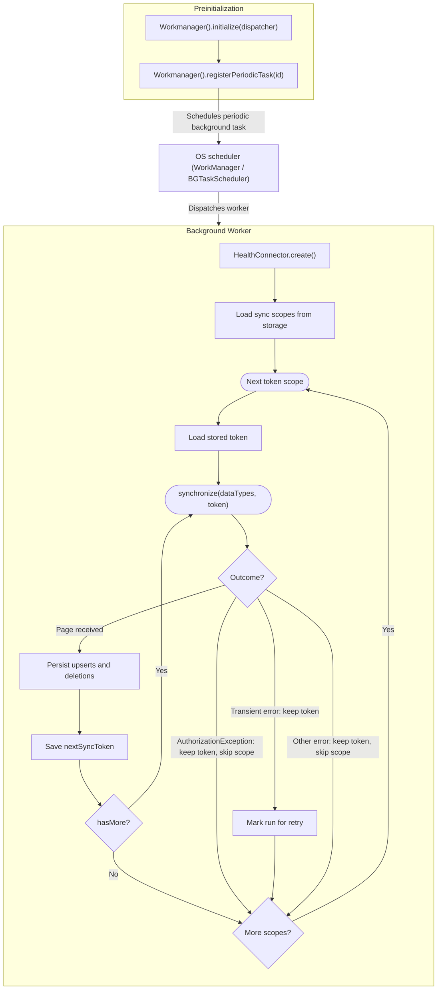

# Recipe: Incremental Background Data Sync

This recipe shows how to keep a local copy of health data up to date while
the app is closed, by combining two APIs:

- `HealthConnector.synchronize` from the
  [`health_connector`](https://pub.dev/packages/health_connector) plugin
  fetches only the records that changed since the last run.
- `Workmanager.registerPeriodicTask` from the [`workmanager`](https://pub.dev/packages/workmanager)
  plugin runs that fetch on a schedule through Android WorkManager and iOS `BGTaskScheduler`.

The result is a headless Dart task that wakes up periodically, drains every
change page for each data type it owns, stores one sync token per data type,
and goes back to sleep.

---

## Table of Contents

- [Prerequisites](#prerequisites)
- [How the pieces fit together](#how-the-pieces-fit-together)
- [Step 1: Decide the token scopes](#step-1-decide-the-token-scopes)
- [Step 2: Declare platform capabilities](#step-2-declare-platform-capabilities)
- [Step 3: Register the iOS launch handler](#step-3-register-the-ios-launch-handler)
- [Step 4: Persist tokens and settings](#step-4-persist-tokens-and-settings)
- [Step 5: Write the sync worker](#step-5-write-the-sync-worker)
- [Step 6: Write the background entry point](#step-6-write-the-background-entry-point)
- [Step 7: Initialize Workmanager and let the user enable the sync](#step-7-initialize-workmanager-and-let-the-user-enable-the-sync)
- [Step 8: Verify a run](#step-8-verify-a-run)
- [Platform behaviour to expect](#platform-behaviour-to-expect)
- [Checklist](#checklist)

---

## Prerequisites

| Requirement        | Version                                             |
|:-------------------|:----------------------------------------------------|
| `health_connector` | 3.x                                                 |
| `workmanager`      | 0.10.x                                              |
| Android            | Health Connect available on the device              |
| iOS                | HealthKit and Background Modes capabilities enabled |

This guide covers only the `workmanager` setup that the sync needs. The
[official Flutter Workmanager documentation](https://docs.page/fluttercommunity/flutter_workmanager)
has the complete platform setup, including the
[quick start](https://docs.page/fluttercommunity/flutter_workmanager/quickstart),
[customization](https://docs.page/fluttercommunity/flutter_workmanager/customization)
of constraints and input data, and
[debugging](https://docs.page/fluttercommunity/flutter_workmanager/debugging).

Add both plugins to `pubspec.yaml`:

```yaml
dependencies:
  health_connector: ^3.11.0
  workmanager: ^0.10.10
  shared_preferences: ^2.5.0 # or any persistence of your choice
```

---

## How the pieces fit together



Three facts drive the design:

1. The background callback runs in its own isolate with a fresh Flutter
   engine. Nothing created in `main()` exists there, so the worker rebuilds
   its connector and storage from scratch.
2. `synchronize` is stateless on the plugin side. The token you pass in is
   the only memory of the previous run, so it must be persisted where both
   isolates can read it.
3. The platform decides when the task runs. Your Dart code only decides what
   to do when it does.

---

## Step 1: Decide the token scopes

A sync token is bound to the exact list of data types it was created for.

Follow this rule when choosing scopes:

> If your app consumes more than one data type independently, use separate
> tokens for each data type. Only use a list of multiple data types with a
> single token if these data types are either consumed together or not at all.

Why it matters:

- **Independent consumers, independent tokens.** If steps feed a widget and
  heart rate feeds a chart, a failure while processing heart rate must not
  block the next steps sync, and adding a third data type later must not
  reset the existing tokens. One token per data type gives each consumer its
  own checkpoint.
- **Joint consumers, one token.** If you always need a workout session and
  its heart-rate samples together to build one screen, a single token keeps
  them at the same checkpoint, so you never show a session whose samples have
  not arrived yet.

Model the scopes explicitly. They are persisted in Step 4 so the headless
worker reads the same selection the UI enabled, which is why the class can
round-trip through JSON by data type id.

```dart
import 'package:health_connector/health_connector.dart';

/// One token scope: the data types that share a single sync token.
final class SyncScope {
  const SyncScope(this.id, this.dataTypes);

  /// Restores a scope written by [toJson], skipping unknown data type ids so
  /// an older selection never blocks the worker after an SDK upgrade.
  factory SyncScope.fromJson(Map<String, dynamic> json) {
    final byId = {for (final type in HealthDataType.values) type.id: type};
    return SyncScope(json['id'] as String, [
      for (final id in (json['dataTypes'] as List<dynamic>).cast<String>())
        if (byId[id] case final type?) type,
    ]);
  }

  /// Stable key used for the persisted token.
  final String id;

  /// Data types that are always consumed together.
  final List<HealthDataType> dataTypes;

  Map<String, dynamic> toJson() => {
    'id': id,
    'dataTypes': [for (final type in dataTypes) type.id],
  };
}

/// The scopes this app syncs. Steps and weight are consumed independently,
/// so each gets its own token. Exercise sessions and heart rate are rendered
/// together, so they share one.
const syncScopes = [
  SyncScope('steps', [HealthDataType.steps]),
  SyncScope('weight', [HealthDataType.weight]),
  SyncScope('workouts', [
    HealthDataType.exerciseSession,
    HealthDataType.heartRate,
  ]),
];
```

---

## Step 2: Declare platform capabilities

The Workmanager
[quick start](https://docs.page/fluttercommunity/flutter_workmanager/quickstart)
walks through the full Android, iOS, and macOS setup; the two subsections
below add only what background health reads require on top of it.

### Android

Add the background read permission to `android/app/src/main/AndroidManifest.xml`
next to the regular Health Connect read permissions. Without it, Health
Connect rejects any read that happens while the app is in background.

```xml

<uses-permission android:name="android.permission.health.READ_HEALTH_DATA_IN_BACKGROUND" />
```

### iOS

In `ios/Runner/Info.plist`, enable the fetch background mode and allow the
task identifier. The identifier must be identical to the one you pass to
`registerPeriodicTask` in Dart.

```xml

<key>UIBackgroundModes</key><array>
<string>fetch</string>
</array><key>BGTaskSchedulerPermittedIdentifiers</key><array>
<string>com.example.app.health_sync</string>
</array>
```

Also enable the **Background Modes → Background fetch** capability on the Runner target in Xcode.

---

## Step 3: Register the iOS launch handler

iOS accepts `BGTaskScheduler` launch handlers only before
`application(_:didFinishLaunchingWithOptions:)` returns, and `submit` crashes
for an identifier without a handler. Register the identifier on every launch
in `ios/Runner/AppDelegate.swift`, and register the plugins for the
background engine so `health_connector` and your storage plugin are reachable
from the headless isolate.

```swift
import Flutter
import UIKit
import workmanager_apple

@main
@objc class AppDelegate: FlutterAppDelegate {
    override func application(
        _ application: UIApplication,
        didFinishLaunchingWithOptions launchOptions: [UIApplication.LaunchOptionsKey: Any]?
    ) -> Bool {
        // Must match BGTaskSchedulerPermittedIdentifiers and the Dart identifier.
        WorkmanagerPlugin.registerPeriodicTask(withIdentifier: "com.example.app.health_sync")
        WorkmanagerPlugin.registerLaunchHandlers()

        // Background tasks run in a separate Flutter engine.
        WorkmanagerPlugin.setPluginRegistrantCallback { registry in
            GeneratedPluginRegistrant.register(with: registry)
        }

        GeneratedPluginRegistrant.register(with: self)
        return super.application(application, didFinishLaunchingWithOptions: launchOptions)
    }
}
```

Android needs no native code for this step.

---

## Step 4: Persist tokens and settings

Both isolates must see the same tokens. `SharedPreferencesAsync` works
because it has no per-isolate cache; every read goes to the platform store.
`SharedPreferences` (the cached API) does not, and would show stale tokens in
the UI after a background run.

Store one token per scope, keyed by the scope id.

```dart
import 'dart:convert';

import 'package:health_connector/health_connector.dart';
import 'package:shared_preferences/shared_preferences.dart';

final class SyncTokenStore {
  SyncTokenStore(this._preferences);

  final SharedPreferencesAsync _preferences;

  String _key(String scopeId) => 'health_sync.token.$scopeId';

  Future<HealthDataSyncToken?> load(String scopeId) async {
    final raw = await _preferences.getString(_key(scopeId));
    if (raw == null) {
      return null;
    }
    return HealthDataSyncToken.fromJson(
      jsonDecode(raw) as Map<String, dynamic>,
    );
  }

  Future<void> save(String scopeId, HealthDataSyncToken? token) {
    if (token == null) {
      return _preferences.remove(_key(scopeId));
    }
    return _preferences.setString(_key(scopeId), jsonEncode(token.toJson()));
  }
}
```

`HealthDataSyncToken.toJson` includes the data types and creation time, which
the worker uses in the next step to detect a scope change.

The worker also needs to know which scopes to sync. Do not compile the list
into the dispatcher; store it. The UI writes the selection when the user
enables the sync, and the headless worker reads it at the start of every run,
so changing the selection never requires re-registering the task.

```dart
final class SyncScopeStore {
  SyncScopeStore(this._preferences);

  final SharedPreferencesAsync _preferences;

  static const _key = 'health_sync.scopes';

  /// Scopes selected in the UI, or an empty list when nothing was saved.
  Future<List<SyncScope>> load() async {
    final raw = await _preferences.getString(_key);
    if (raw == null) {
      return const [];
    }
    return [
      for (final item in jsonDecode(raw) as List<dynamic>)
        SyncScope.fromJson(item as Map<String, dynamic>),
    ];
  }

  Future<void> save(List<SyncScope> scopes) {
    return _preferences.setString(
      _key,
      jsonEncode([for (final scope in scopes) scope.toJson()]),
    );
  }
}
```

---

## Step 5: Write the sync worker

The worker is plain Dart, so it runs unchanged inside the headless isolate.
It loads the scopes from `SyncScopeStore` at the start of every run, so it
always syncs what the UI last saved. Then, for every scope, it:

1. Loads the stored token and discards it if its data types no longer match
   the scope.
2. Calls `synchronize` until `hasMore` is false, saving the token after every
   page so a killed task resumes from the last page instead of the first.
3. On `AuthorizationException`, skips the scope and keeps its token. The user
   revoked a read permission or the background read permission since the
   last run, and only the user can grant it again, so the worker neither
   retries nor touches the checkpoint.
4. Reports whether the scheduler should retry.

The worker does not check permissions up front; it lets `synchronize` fail
and catches the result.

```dart
import 'package:health_connector/health_connector.dart';

/// Outcome of one worker run.
final class SyncRunResult {
  const SyncRunResult({required this.shouldRetry});

  /// True only for transient platform errors worth a scheduler retry.
  final bool shouldRetry;
}

final class HealthSyncWorker {
  HealthSyncWorker({
    required this.connector,
    required this.syncTokenStorage,
    required this.syncScopeStorage,
    required this.onChanges,
  });

  final HealthConnector connector;
  final SyncTokenStore syncTokenStorage;
  final SyncScopeStore syncScopeStorage;

  /// Called once per page with the changes of one scope. Persist them here.
  final Future<void> Function(SyncScope scope, HealthDataSyncResult page)
  onChanges;

  Future<SyncRunResult> run() async {
    final syncScopes = await syncScopeStorage.load();
    var shouldRetry = false;
    for (final scope in syncScopes) {
      try {
        await _syncScope(scope);
      } on AuthorizationException {
        // The user revoked a read permission of this scope or the background
        // read permission. Keep the stored token so the next run resumes from
        // the same checkpoint once the permission is back, and do not retry:
        // only the user can fix this.
        continue;
      } on HealthConnectorException catch (e) {
        // One scope failing must not stop the others. Keep the stored token so
        // the next run resumes from the same checkpoint.
        shouldRetry = shouldRetry || _isTransient(e.code);
      }
    }
    return SyncRunResult(shouldRetry: shouldRetry);
  }

  Future<void> _syncScope(SyncScope scope) async {
    var token = await syncTokenStorage.load(scope.id);
    if (token != null && !_sameDataTypes(token.dataTypes, scope.dataTypes)) {
      // The scope changed since the token was created. A token is bound to
      // its data types, so start over rather than throw on the first call.
      token = null;
    }

    var hasMore = true;
    while (hasMore) {
      final page = await connector.synchronize(
        dataTypes: scope.dataTypes,
        syncToken: token,
      );
      await onChanges(scope, page);
      token = page.nextSyncToken;
      hasMore = page.hasMore;
      // Save after every page. If the OS kills the task mid-run, the next
      // run continues from here instead of re-reading earlier pages.
      await syncTokenStorage.save(scope.id, token);
    }
  }

  static bool _isTransient(HealthConnectorErrorCode code) {
    return switch (code) {
      HealthConnectorErrorCode.rateLimitExceeded ||
      HealthConnectorErrorCode.dataSyncInProgress ||
      HealthConnectorErrorCode.healthServiceDatabaseInaccessible ||
      HealthConnectorErrorCode.ioError ||
      HealthConnectorErrorCode.remoteError => true,
      _ => false,
    };
  }

  static bool _sameDataTypes(List<HealthDataType> a,
      List<HealthDataType> b,) {
    return a.length == b.length && a.toSet().containsAll(b);
  }
}
```

A first run with no stored token returns no records; it only establishes the
baseline and hands back the first token. Every later run returns the changes
since the previous token.

---

## Step 6: Write the background entry point

The dispatcher is the function the platform calls when the task fires. It
must be a top-level function annotated with `@pragma('vm:entry-point')` so
the Dart VM keeps it reachable by callback handle in release builds.

```dart
import 'package:health_connector/health_connector.dart';
import 'package:shared_preferences/shared_preferences.dart';
import 'package:workmanager/workmanager.dart';

/// Identifier of the periodic task. Reused as the unique name, the task name,
/// and the iOS BGTaskScheduler identifier.
const healthSyncTaskId = 'com.example.app.health_sync';

@pragma('vm:entry-point')
void healthSyncDispatcher() {
  Workmanager().executeTask((taskName, inputData) async {
    if (taskName != healthSyncTaskId) {
      // Unknown work is reported as done so the scheduler drops it.
      return true;
    }

    final preferences = SharedPreferencesAsync();
    final connector = await HealthConnector.create();
    final worker = HealthSyncWorker(
      connector: connector,
      syncTokenStorage: SyncTokenStore(preferences),
      syncScopeStorage: SyncScopeStore(preferences),
      onChanges: (scope, page) async {
        // Write page.upsertedRecords and page.deletedRecordIds to your
        // database here.
      },
    );

    final result = await worker.run();
    // false asks Android WorkManager to retry with the backoff policy.
    // iOS has no automatic retry; the next periodic run picks the work up.
    return !result.shouldRetry;
  });
}
```

Keep the callback fast. iOS grants app refresh tasks roughly 30 seconds, and
the plugin marks the task failed if the callback has not returned by then.

---

## Step 7: Initialize Workmanager and let the user enable the sync

Initialize the plugin in `main()` before `runApp` so the callback handle is
registered on every launch. Then give the user one switch. Enabling it
requests the permissions first and registers the periodic task only when the
background read permission came back granted; a task without that permission
would wake up every 15 minutes just to fail. Disabling it cancels the task.

The widget below is deliberately minimal: one `Workmanager` and one
`HealthConnector`, both private to the state, and a single button.

```dart
import 'package:flutter/material.dart';
import 'package:health_connector/health_connector.dart';
import 'package:shared_preferences/shared_preferences.dart';
import 'package:workmanager/workmanager.dart';

Future<void> main() async {
  WidgetsFlutterBinding.ensureInitialized();
  await Workmanager().initialize(healthSyncDispatcher);
  runApp(const MyApp());
}

class MyApp extends StatefulWidget {
  const MyApp({super.key});

  @override
  State<MyApp> createState() => _MyAppState();
}

class _MyAppState extends State<MyApp> {
  final _workmanager = Workmanager();
  final _syncScopeStorage = SyncScopeStore(SharedPreferencesAsync());
  late final Future<HealthConnector> _healthConnector =
      HealthConnector.create();

  bool _isEnabled = false;
  String _message = '';

  @override
  void initState() {
    super.initState();
    _loadScheduledState();
  }

  /// Reads the scheduler's view so the switch matches reality after a
  /// restart. iOS drops pending requests on reinstall or update, so an
  /// enabled task is re-submitted here on every launch.
  Future<void> _loadScheduledState() async {
    final info = await _workmanager.getWorkInfo(healthSyncTaskId);
    final isEnabled = info != null && info.state != WorkState.cancelled;
    if (isEnabled) {
      await _registerPeriodicTask();
    }
    if (mounted) {
      setState(() => _isEnabled = isEnabled);
    }
  }

  Future<void> _enableBackgroundSync() async {
    final connector = await _healthConnector;

    // Background reads need an explicit permission on Health Connect. On
    // HealthKit the feature is always available and the permission is
    // auto-granted, so this branch only matters on Android.
    const background = HealthPlatformFeature.readHealthDataInBackground;
    final status = await connector.getFeatureStatus(background);
    if (status != HealthPlatformFeatureStatus.available) {
      _show('This device cannot read health data in the background.');
      return;
    }

    final results = await connector.requestPermissions([
      for (final scope in syncScopes)
        for (final type in scope.dataTypes) type.readPermission,
      background.permission,
    ]);
    final backgroundGranted = results.any(
      (result) =>
          result.permission == background.permission &&
          result.status == PermissionStatus.granted,
    );
    if (!backgroundGranted) {
      _show('Background read permission was not granted.');
      return;
    }

    // Persist the selection before the task exists, so the first run never
    // finds an empty list.
    await _syncScopeStorage.save(syncScopes);
    await _registerPeriodicTask();
    _show('Background sync enabled.');
    setState(() => _isEnabled = true);
  }

  Future<void> _disableBackgroundSync() async {
    await _workmanager.cancelByUniqueName(healthSyncTaskId);
    _show('Background sync disabled.');
    setState(() => _isEnabled = false);
  }

  Future<void> _registerPeriodicTask() {
    return _workmanager.registerPeriodicTask(
      healthSyncTaskId, // unique name
      healthSyncTaskId, // task name handed to the dispatcher
      // Android enforces a 15 minute minimum. iOS treats it as a hint.
      frequency: const Duration(minutes: 15),
      // Keep the existing schedule when re-enabling.
      existingWorkPolicy: ExistingPeriodicWorkPolicy.update,
      // Android retries with exponential backoff when the callback returns
      // false.
      backoffPolicy: BackoffPolicy.exponential,
      backoffPolicyDelay: const Duration(minutes: 1),
      constraints: Constraints(requiresBatteryNotLow: true),
    );
  }

  void _show(String message) {
    if (mounted) {
      setState(() => _message = message);
    }
  }

  @override
  Widget build(BuildContext context) {
    return MaterialApp(
      home: Scaffold(
        appBar: AppBar(title: const Text('Background health sync')),
        body: Center(
          child: Column(
            mainAxisSize: MainAxisSize.min,
            children: [
              Text(
                _isEnabled
                    ? 'Background sync is on'
                    : 'Background sync is off',
              ),
              const SizedBox(height: 16),
              FilledButton(
                onPressed:
                    _isEnabled ? _disableBackgroundSync : _enableBackgroundSync,
                child: Text(_isEnabled ? 'Disable' : 'Enable'),
              ),
              const SizedBox(height: 16),
              Text(_message),
            ],
          ),
        ),
      ),
    );
  }
}
```

Using the same string for the unique name, the task name, and the iOS
identifier keeps the dispatcher platform-agnostic: Android hands the task
name to Dart, iOS hands the `BGTaskScheduler` identifier.

---

## Step 8: Verify a run

Do not add an in-app "run now" button that calls the worker from the UI
isolate. It skips the headless engine, the background permission, and the
scheduler contract, so it hides exactly the failures you need to find. Force
a real run instead.

**Android** (debug builds only):

```bash
adb shell dumpsys jobscheduler | grep com.example.app
adb shell cmd jobscheduler run -f com.example.app <JOB_ID>
```

**iOS**: run the app from Xcode, pause it in the debugger, then in the LLDB
console:

```objc
e -l objc -- (void)[[BGTaskScheduler sharedScheduler] _simulateLaunchForTaskWithIdentifier:@"com.example.app.health_sync"]
```

The Workmanager
[debugging](https://docs.page/fluttercommunity/flutter_workmanager/debugging)
page explains the debug handlers and log output, and the
[troubleshooting](https://docs.page/fluttercommunity/flutter_workmanager/troubleshooting)
page covers OEM battery optimizers that keep Android tasks from firing.

---

## Platform behaviour to expect

| Topic                 | Android (Health Connect)                                      | iOS (HealthKit)                                                            |
|:----------------------|:--------------------------------------------------------------|:---------------------------------------------------------------------------|
| Minimum interval      | 15 minutes, delayed further under battery optimization        | Opportunistic; may be hours apart                                          |
| Time budget per run   | Generous; WorkManager stops at 10 minutes                     | About 30 seconds                                                           |
| Token expiry          | About 30 days; `InvalidArgumentException`                     | Tokens do not expire                                                       |
| Locked device         | Reads work                                                    | Reads fail with `healthServiceDatabaseInaccessible`; retry on the next run |
| Retry on `false`      | Exponential backoff per `backoffPolicy`                       | None; next periodic run                                                    |
| Background permission | `READ_HEALTH_DATA_IN_BACKGROUND`, requestable through the SDK | None; user may restrict in Settings                                        |

---

## Checklist

- [ ] One `SyncScope` per independently consumed data type; shared scopes
  only for data types consumed together or not at all.
- [ ] `READ_HEALTH_DATA_IN_BACKGROUND` declared in the Android manifest.
- [ ] `UIBackgroundModes: fetch` and `BGTaskSchedulerPermittedIdentifiers` in
  `Info.plist`, with the same identifier used in Dart.
- [ ] `WorkmanagerPlugin.registerPeriodicTask(withIdentifier:)` and
  `setPluginRegistrantCallback` in `AppDelegate.swift`.
- [ ] Tokens and the scope selection stored through `SharedPreferencesAsync`
  or another store with no per-isolate cache; the worker loads the scopes at
  the start of every run.
- [ ] Dispatcher is top-level and annotated with `@pragma('vm:entry-point')`.
- [ ] `Workmanager().initialize` runs in `main()` on every launch.
- [ ] Worker catches `AuthorizationException` per scope, keeps that scope's
  token, and does not ask for a retry.
- [ ] Token saved after every page; scope failures isolated.
- [ ] Verified with a forced platform run, not an in-app trigger.
