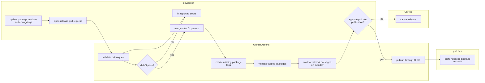

# Release

This guide lists only the actions a developer performs to release Health Connector packages. CI/CD handles validation,
package tags, dependency ordering, and publication to pub.dev.

The release environment, repository secrets, pub.dev trusted publishers, and required developer tools are expected to
be configured already.

## Release at a glance



The developer prepares, reviews, merges, and approves the release. Everything else is automatic.

## Developer steps

### 1. Prepare the release changes

Choose a semantic version for every package being released:

| Change | Version change | Example |
| --- | --- | --- |
| Breaking public API change | Major | `3.2.1` to `4.0.0` |
| Backwards-compatible functionality | Minor | `3.2.1` to `3.3.0` |
| Backwards-compatible fix | Patch | `3.2.1` to `3.2.2` |

Use a prerelease suffix while a version is not ready for stable consumers:

| Release stage | Version examples |
| --- | --- |
| Alpha | `4.0.0-alpha`, `4.0.0-alpha.1` |
| Beta | `4.0.0-beta`, `4.0.0-beta.1` |
| Release candidate | `4.0.0-rc`, `4.0.0-rc.1` |
| Stable | `4.0.0` |

The package CD workflows accept only `MAJOR.MINOR.PATCH` and the `alpha`, `beta`, and `rc` forms shown above. Each
prerelease label may have one optional non-negative numeric identifier. Leading zeroes, build metadata such as
`+build.5`, other prerelease labels, and additional identifiers are rejected. Use the same full version in the package
pubspec, changelog heading, and generated `<package>-v<version>` tag.

Use Melos to update the selected packages. The repository allows this command on `main`, so run it before creating the
release branch. Include one `-V` argument for every selected package and replace the example versions:

```bash
fvm dart run melos version \
  -V "health_connector_core:REPLACE_ME" \
  -V "health_connector_hc_android:REPLACE_ME" \
  -V "health_connector_hk_ios:REPLACE_ME" \
  -V "health_connector:REPLACE_ME" \
  --no-git-commit-version \
  --no-git-tag-version
```

Add or remove package arguments to match the release scope. The releasable packages are:

- `health_connector_lint`
- `health_connector_logger`
- `health_connector_core`
- `health_connector_hc_android`
- `health_connector_hk_ios`
- `health_connector`

Melos updates package versions, changelogs, and affected internal dependency constraints. It does not generate or
format source files.

Always update `health_connector`. Its version change starts the coordinated release after the pull request is merged.

#### Manage package changelogs

Each package owns `packages/<package>/CHANGELOG.md`. Melos prepends the new version section and generates entries from
Conventional Commit metadata. Use the generated section as the starting point; do not reconstruct it from Git history.

Keep each changelog focused on its package:

| Package | Changelog scope |
| --- | --- |
| `health_connector` | Consumer-visible SDK changes across the facade, core, Android, and iOS packages |
| `health_connector_core` | Shared Dart APIs, models, validation, and behavior |
| `health_connector_hc_android` | Android Health Connect behavior, native dependencies, and build requirements |
| `health_connector_hk_ios` | iOS HealthKit behavior, native dependencies, and platform requirements |
| `health_connector_lint` | Shared analyzer rules and lint configuration |
| `health_connector_logger` | Logging API and behavior |

Apply these shared rules to every generated changelog section:

- Keep releases in descending order under `## <version>` headings without dates.
- Keep Melos-generated type labels such as `FEAT`, `FIX`, `REFACTOR`, `PERF`, `BUILD`, `DOC`, `DEPS`, and `CHORE`.
- Keep `BREAKING` before the change type and keep the generated commit links. Do not add or rebuild links manually.
- Rewrite unclear generated descriptions so each bullet names the package or user impact, starts with an active verb, and
  ends with a period.
- Use scopes in the facade or core changelog when they clarify that a consumer-visible change comes from Android or iOS.
  The platform package's own changelog normally does not need that scope.
- For a dependency-only release, use one concise entry that names the updated internal dependency. Do not leave an empty
  version section.
- For a breaking release, add `> Note: This release has breaking changes.` immediately below the version heading and
  mark every breaking entry with `**BREAKING**`. Link the facade entry to a guide under `docs/guides/` when migration
  requires more than the changelog bullet.
- `health_connector_lint` currently collects pending changes under `## Unreleased`. When releasing it, merge those
  entries into the new version section without duplicates and remove the empty `Unreleased` section.
- Never delete published entries or silently change what a published release contained. If a version is retracted, keep
  its section and add a `**RETRACTED**` notice that explains the impact, names the replacement version, and links to the
  tracking issue.

The `health_connector` changelog is the consumer-facing summary. Include relevant core, Android, and iOS changes there
instead of reducing a release to an internal dependency-update entry.

Do not create package tags or publish packages locally. Do not run release validation locally; CI performs it.

### 2. Open the release pull request

Create the release branch after Melos has generated the release changes. Commit the version, changelog, dependency,
and migration changes, then open a pull request against `main`.

List these items in the pull request description:

- every package and its new version;
- breaking changes; and
- migration guides.

CI validates the release changes. If a check fails, use its logs to find the problem and push the fix to the same pull
request. Do not repeat successful CI checks locally.

### 3. Merge the release pull request

Review and merge the pull request after all required checks pass.

The `health_connector` version change on `main` starts `CD - release packages`. The workflow creates annotated tags for
package versions that do not already have tags. Each new tag starts that package's CD workflow.

Do not create, move, or push release tags manually.

### 4. Approve publication

Each package CD workflow validates the version format and matches its tag to the package before running any
package-specific checks. These jobs check and validate repository files without regenerating or formatting them. The
workflow then waits until the package's new internal dependencies are available on pub.dev.

GitHub pauses publication at the protected `pub.dev` environment. Approve each release when GitHub requests approval.
Publication then uses GitHub OIDC and completes automatically.

After publication, GitHub records a successful deployment named `pub.dev / <package>` with a link to the exact package
version. The release is complete when every selected package CD workflow succeeds. No manual pub.dev or Git tag
verification is required.

## If CI/CD fails

- If pull request CI fails, fix the same pull request and wait for CI to run again.
- If `CD - release packages` fails because of a temporary error, rerun the entire workflow. It skips package tags that
  already exist and creates the missing tags.
- If a package CD workflow fails because of a temporary error, rerun that workflow.
- If code or package metadata is wrong after a tag exists, prepare a new version in a new pull request. Do not move or
  reuse the existing tag.
- If a published package is wrong, prepare corrected versions for that package and affected dependents in a new pull
  request. pub.dev versions cannot be overwritten.

## What CI/CD does

After the release pull request is merged, CI/CD:

1. detects the new `health_connector` version on `main`;
2. creates missing annotated package tags in dependency order;
3. starts the CD workflow for every new package tag;
4. rejects unsupported version formats and validates that each tag matches its package version;
5. runs the applicable Dart, Kotlin, Swift, Android, and iOS checks;
6. waits until required internal package versions are available on pub.dev;
7. waits for protected `pub.dev` environment approval; and
8. publishes each approved package through GitHub OIDC; and
9. records each published package version in GitHub Deployments.

## GitHub deployments

GitHub deployment history separates documentation deployments from package releases:

| Environment | Created by | Target |
| --- | --- | --- |
| `Preview` | Vercel Git integration for pull requests and non-production branches | Commit-specific preview URL |
| `Production` | Vercel Git integration for `main` | Production documentation site |
| `pub.dev / <package>` | Package CD after successful publication | Exact package version on pub.dev |

The protected `pub.dev` environment remains the approval gate shared by all packages. The package-specific environments
record completed releases and do not replace that gate.

## Rules

- Never publish a package locally.
- Never run release validation locally.
- Never create, move, or verify release tags manually.
- Never verify pub.dev manually as part of the release flow.
- Fix release failures through a pull request or rerun the failed workflow when the error is temporary.
