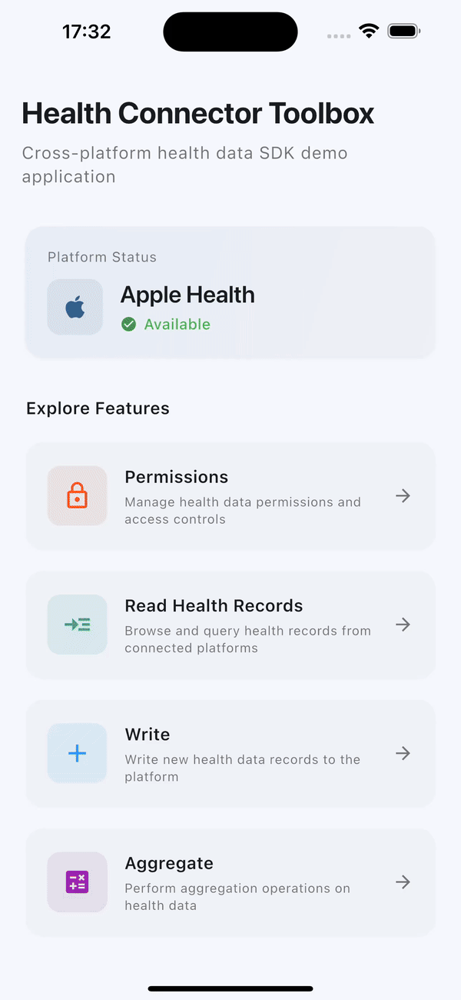
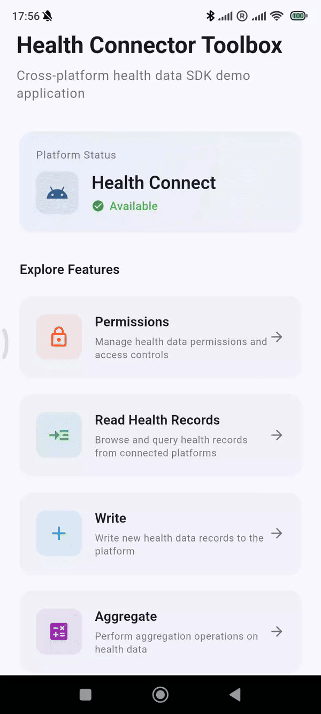
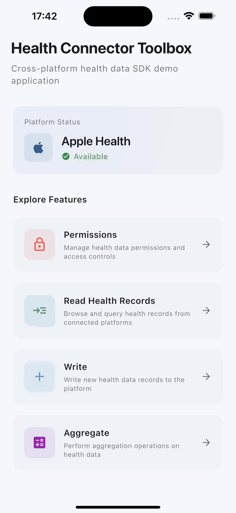
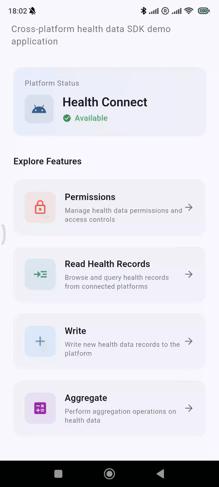
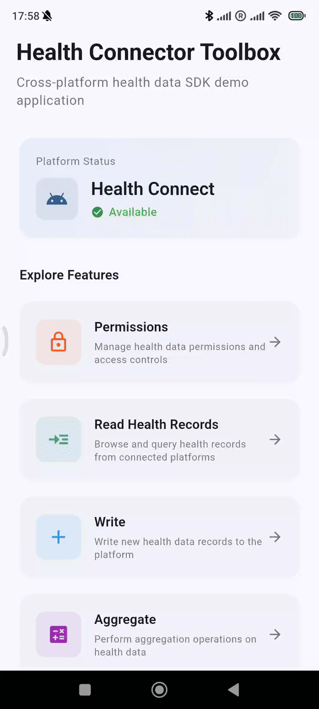
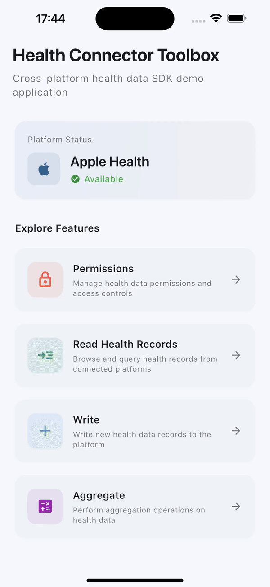
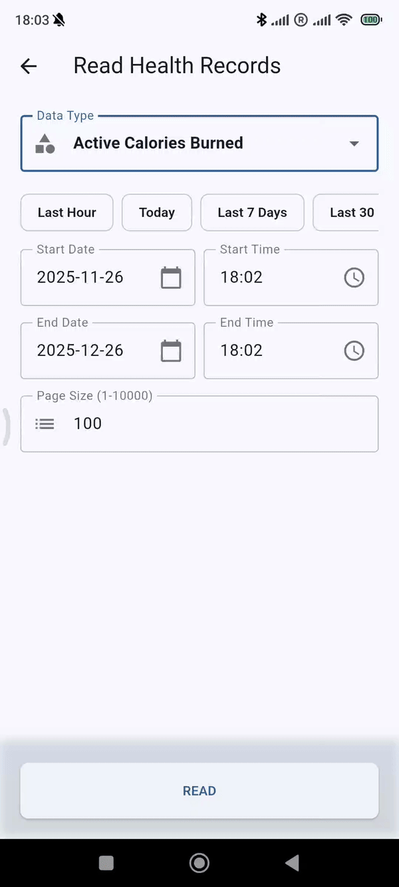
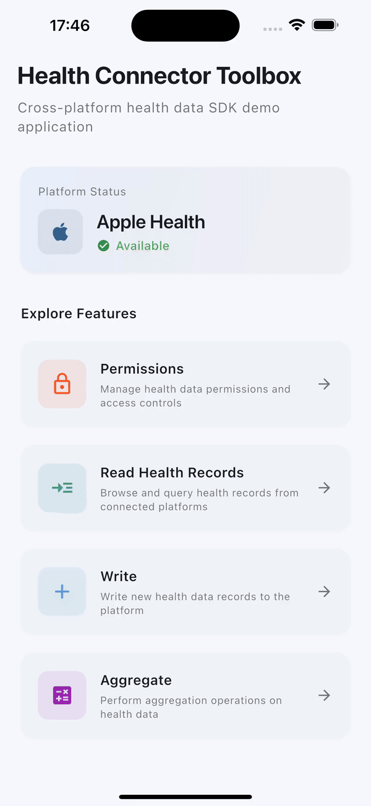
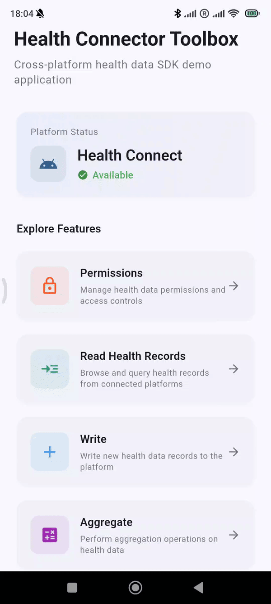

# Health Connector Toolbox

Health Connector Toolbox is a private, on-device health-data inspector. Choose
which data it can access, browse records from Apple Health or Health Connect,
view summaries, add entries, and delete entries created by the app.

The optional Developer Tools mode exposes technical details for the same flows,
including permission state, mapped record metadata, supported aggregations, and
incremental sync behavior. It never expands the permissions you select.

The public mobile app does not collect or transmit health data. Read the
[Toolbox privacy policy](/legal/toolbox-privacy).

## Support

Email [fam.tung.lam@gmail.com](mailto:fam.tung.lam@gmail.com) for installation,
privacy, or app-support questions. Do not email health records or screenshots
containing health data.

Use the public
[Health Connector SDK issue tracker](https://github.com/fam-tung-lam/health_connector/issues)
only for non-sensitive bug reports. Remove health values, record identifiers,
dates, and device names before posting logs.

## Developer source and SDK diagnostics

The source version demonstrates every Health Connector SDK operation against a
real device on both platforms. Use it to compare your integration with a known
working flow.

### Run the source version

```bash
git clone https://github.com/fam-tung-lam/health_connector.git
cd health_connector/examples/health_connector_toolbox
flutter pub get && flutter run
```

::: info The source project is not a reference architecture
The public app is a personal health-data inspector. Its optional Developer Tools
mode and source project also exercise the SDK during development. For production
integration patterns, use the [app recipes](/recipes/).
:::

## What it demonstrates

### Request permissions

<PlatformTabs>
<template #ios>



</template>
<template #android>



</template>
</PlatformTabs>

### Read data

<PlatformTabs>
<template #ios>



</template>
<template #android>



</template>
</PlatformTabs>

### Write data

<PlatformTabs>
<template #ios>


</template>
<template #android>



</template>
</PlatformTabs>

### Delete data

<PlatformTabs>
<template #ios>



</template>
<template #android>



</template>
</PlatformTabs>

### Aggregate data

<PlatformTabs>
<template #ios>



</template>
<template #android>



</template>
</PlatformTabs>

## Using it to debug your own app

If a flow works in the toolbox on the same device but not in your app, the difference is configuration — usually a missing `<uses-permission>` on Android or a missing usage description on iOS. Start with [Setup troubleshooting](/guide/troubleshooting).

If it fails in the toolbox too, that is worth reporting. Include your device, OS version, Flutter version, and the output from a `PrintLogProcessor`.

<NextSteps
  :links="[
    { text: 'Your first integration', link: '/guide/quickstart', description: 'Build the same flows in your own app.' },
    { text: 'Setup troubleshooting', link: '/guide/troubleshooting', description: 'When the toolbox works and your app does not.' },
    { text: 'Report an issue', link: 'https://github.com/fam-tung-lam/health_connector/issues', description: 'When the toolbox fails too.' },
  ]"
/>
